# How to customize the landing page ?

## Introduction 

The landing page was built with [Next.js](https://nextjs.org/).  
It's a React framework and is not a CMS.  
The good thing is that you can customize like every texts and images in your landing page.

To interact with the text and images of the website, you will have to use Google's cloud services: <u>Firebase</u>

To URL to the Firebase Dashboard of the Landing is : 
https://console.firebase.google.com/project/inrealartlanding-3a094/overview

You need credentials to authenticate. Ask them to Timothée

### Firebase 

When you are on the dashboard of Firebase, you will interact with only 2 Google cloud services : 
 - Firestore Database
 - Storage

Below is the left menu of the dashboard : 

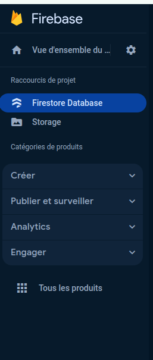

<i>Firestore Database</i> to modify only texts 
<i>Storage</i> to modify only images

Remarks : you will be able to handle translations with this system as well

The <i>Firestore Database</i> contains 3 entities : 
 - Collections
 - Documents
 - Fields

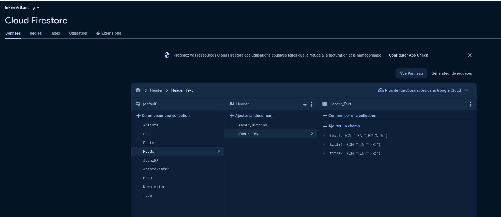

You will only change the entity <i>Fields</i> to modify the texts on the website

<b><u>IMPORTANT REMARK :</u>

WHEN YOU CHANGE SOMETHING IN FIRESTORE DATABASE OR STORAGE,  
YOU ALWAYS HAVE TO REFRESH THE LANDING PAGE TO SEE EFFECTS ON YOUR CHANGES
</b>

## Deployment URL

 - preprod : https://landing-in-real-art.vercel.app/

## Components

The landing page is divided into several components : 
 - Header
 - JoinMovement
 - Artists
 - HelpIra
 - NewsLetter
 - HowToJoinIra
 - Team
 - Menu
 - Footer

### <i>Header</i> Component    

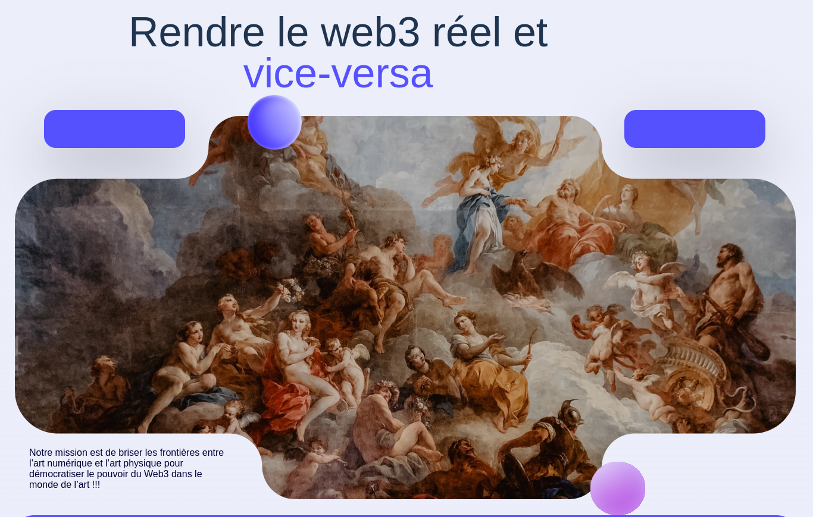

In the header, we have 3 texts : 
 - 1 part of the title in black font called _title1_
 - 1 part of the title in purple font called _title2_
 - 1 text in the left bottom called _text1_

As you can handle translations, each of these fields contains sub-fields for translations in the 3 languages : 

 - CN (Chinese)
 - EN (English)
 - FR (French)

So, in order to modify texts of the header of the website, Go to 
_Header_ (collection) > _Header_Text_ (document) > Fields

 
 
With the screenshot above, you can clearly see the matching between the text in the website and the text you can modify.

To modify the text, you must make a mouse hover on the field.  
Then a pen appears.
Click on the pen to modify the field

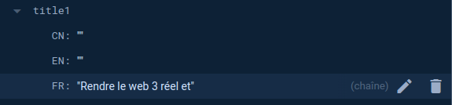

As you can notice, there is no text in the firestore DB for the _EN_ language. 
So when you want to change the _lang_ on the website with the world icon on the menu

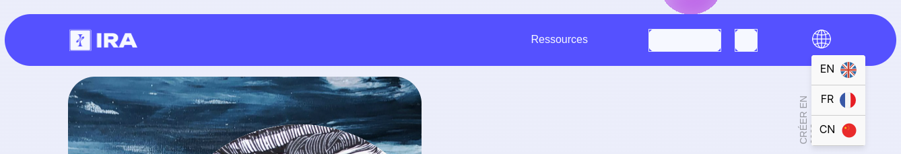

The title is empty

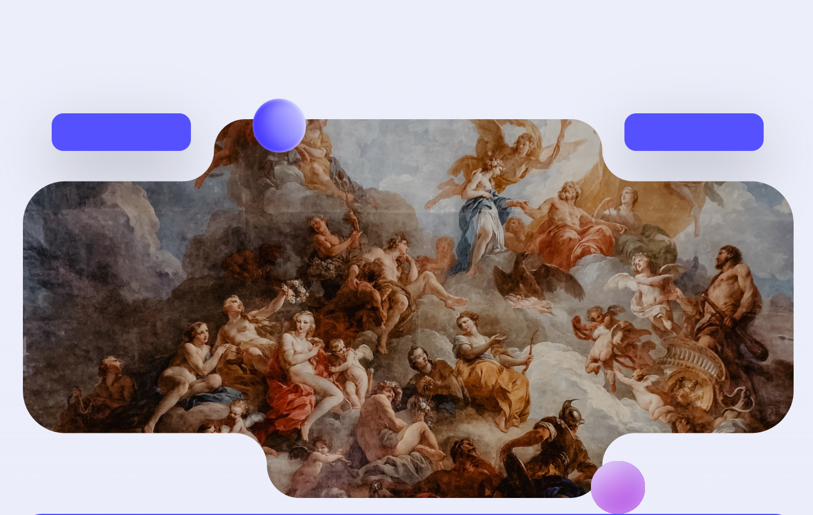

To modify this, do it in firestore DB :

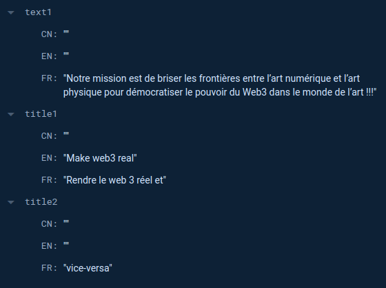

Now, refresh the page of the website and select english language

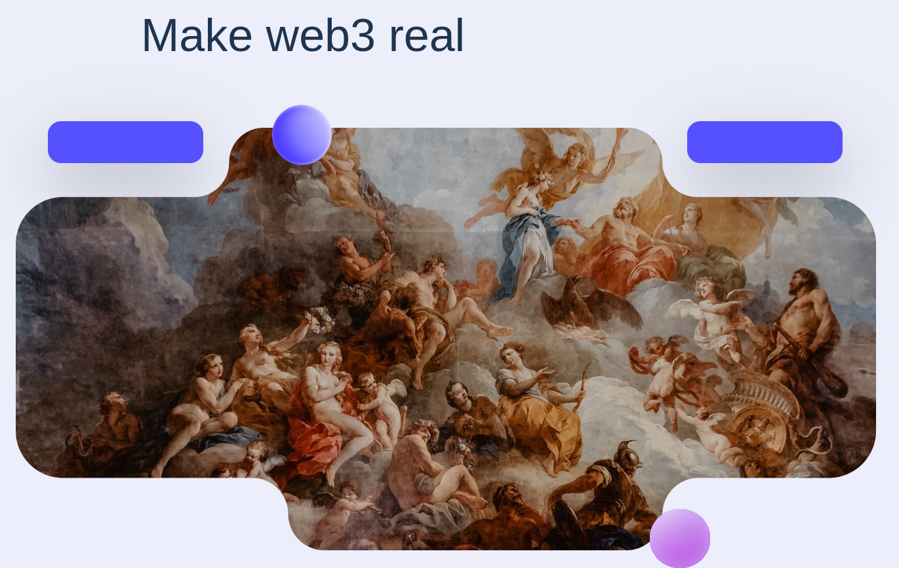

It works !!

You can now customize everything in the page by doing like this.

There are some tricks for artists carousel and team carousel, but the way of changing texts, images, links is the same !

For instance to modify the texts of the buttons in the header component, go to the document _Header_Buttons_

### <i>HowToJoinIra</i> Component    

This component is the one just below the menu

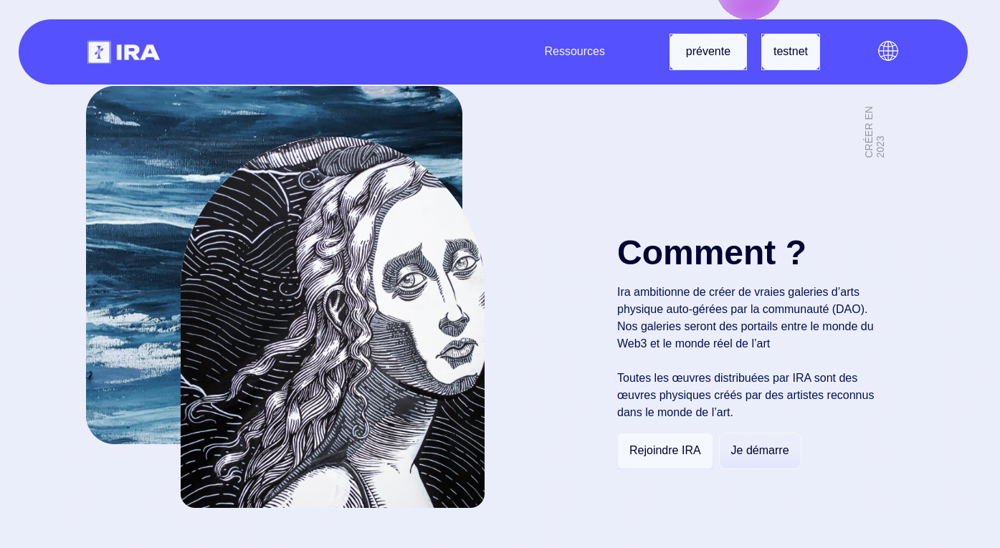

On this component, you can modify some raw texts, some buttons texts and some links for buttons. 
Go to appropriate fields in the Firestore Database

On the example above, we just set the link for the button _Join IRA_. 
It is set to _google.com_.  
It means that the URL set on the button is _https://google.com_.
You can customize all the links in the page like this

### <i>JoinMovement</i> Component    

This component is this one : 

On this component, you can modify texts, texts inside buttons and links of the buttons
Below is the matching collection in _Firestore DB_

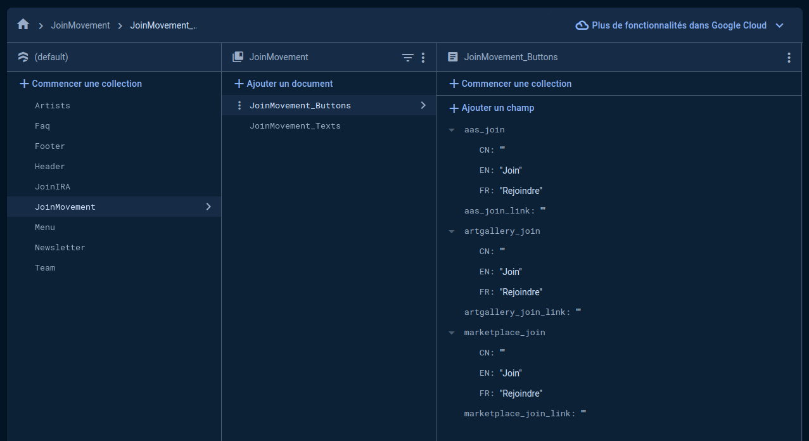

### <i>Artists</i> Component    

This component is this one : 

It behaves like a carousel.   
I mean you can scroll left and right and customize all the images you want 
for the panel #1 in the carousel and the panel #2, etc ...

The panel of the carousel is organized with specific positions for images : 

To scroll left or right, when you do a mouse hover on the panel, some light arrows appear on the left and on the right 

Example below : 

The question is : How to customize my images of each panels ? 
Quite simple.  
Go to the appropriate collection in _Firestore DB_

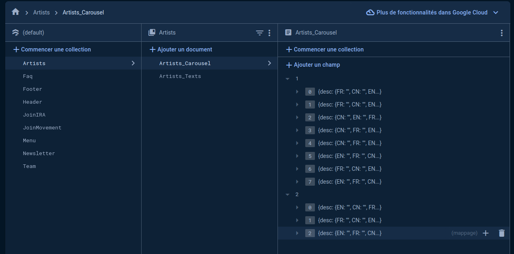

The carousel is set with document called _Artists_Carousel_

On the screenshot above for _Firestore_ we can notice that we have 2 panels : 
 - 1 panel called _1_ with 8 elements
 - 1 panel called _2_ with 3 elements

The elements in the panel are the images that appear in the panel of the website 
according to the specific position explained above.

For instance, in _Firestore_, the image at position 2 must be 
the second element of the array so with index _1_ (because the first index is 0). 
See below : 

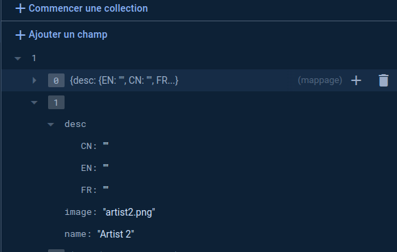

We provide the string _artists2.png_ for the subfield _image_. 
But where is stored this image ?

This image is stored in the _Storage_ service of the Google cloud platform (GCP)

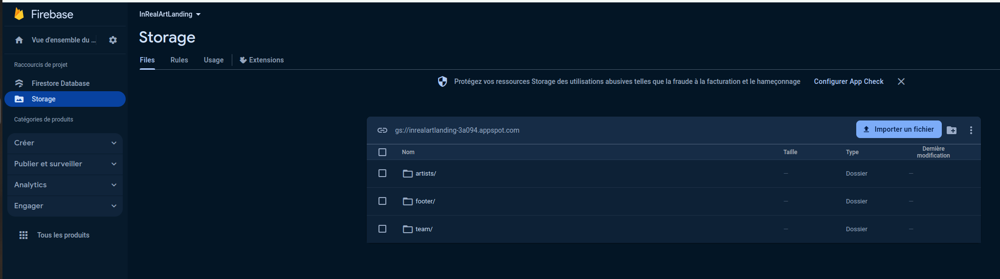

Open the directory _artists_. 
We can see 2 directories : 

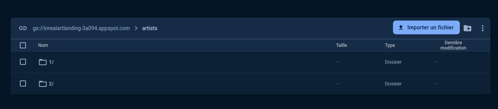

<b>
IMPORTANT REMARK !!
</b>

One important thing is that the panels in the _Storage_ must be the same than the panels in the _Firestore Database_

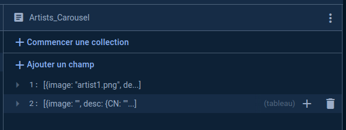

<b>
You must absolutely respect this rule otherwise the website will not work. 
So here, 2 panels called "1" and "2" both in "Firestore DB" & "Storage"
</b>

 

#### Example 1
If you want to make an image unvisible, just empty the subfield _image_ of the panel element. 
Example : the image #3 has no image

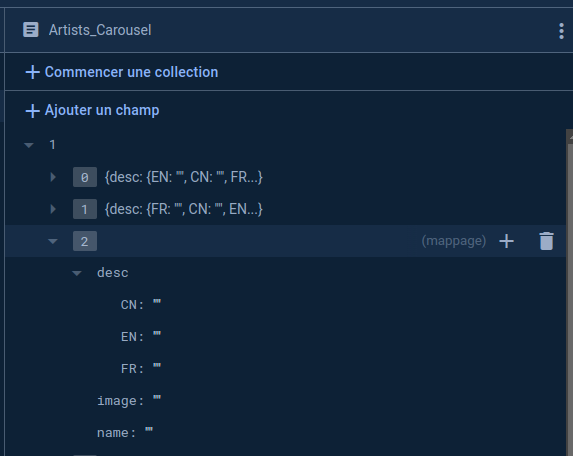

Refresh the page

#### Example 2
Add a second panel in the carousel with only the image on position #3 visible. 
You must create all elements panel before the element panel you want, 
so element panel #1, element panel #2 and element panel #3 of course like below

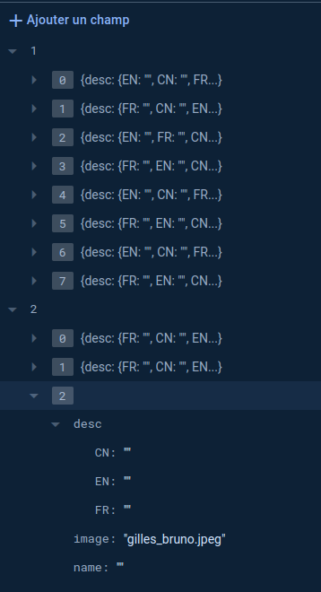

You provide the image _gilles_bruno.jpeg_.  
So you must upload this image with the same name in the appropriate panel in the _Storage_.  
So the path must be :  
_artists > 2 > |your_image|_

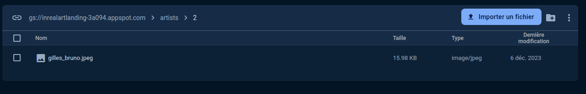

This way, when you scroll right in the carousel, you will see only this image on position #3

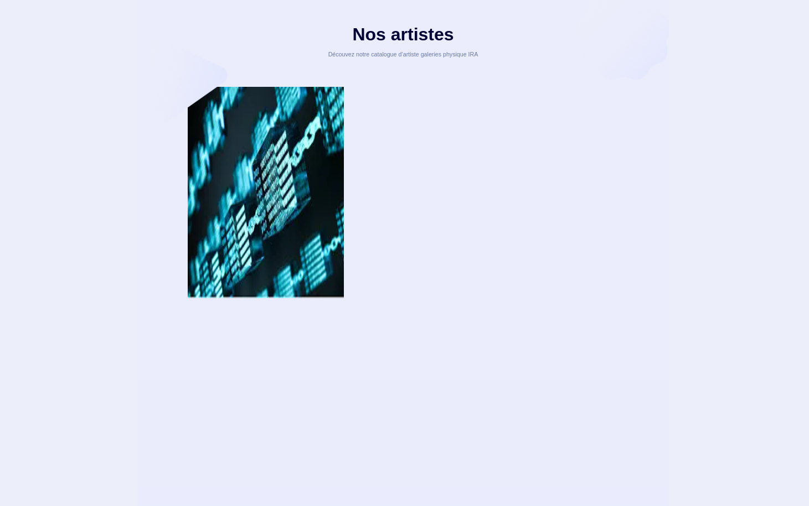

#### Example 3

You can customize the name of the artist and the description of the artist as well ! 
When you do a mouse hover on an image, the image smoothly disappear to let you see name and desc.

 
To do it : simple !
Modify the fields called _desc_ (for description) like below : 

 

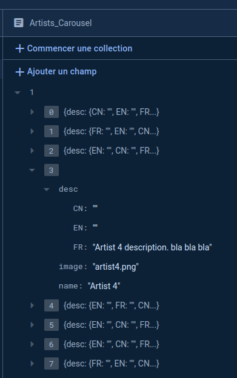

### <i>Team</i> Component    

This component represents the team carousel

This carousel is completely customizable like the artists carousel. 
You can add team member, texts, photos like you want

### <i>HelpIra</i> Component    

This component represents the FAQ

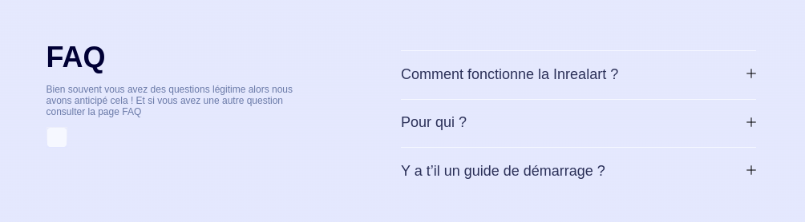

Completely customizable component. 
You can customize the question and answer that appear when you click on "+" button

### <i>NewsLetter</i> Component    

This component represents the _Newsletter_

### <i>Menu</i> Component    

This component represents the _Menu_

### <i>Footer</i> Component    

This component represents the _Footer_. 
You can customize texts, buttons texts, and button links on the footer 

